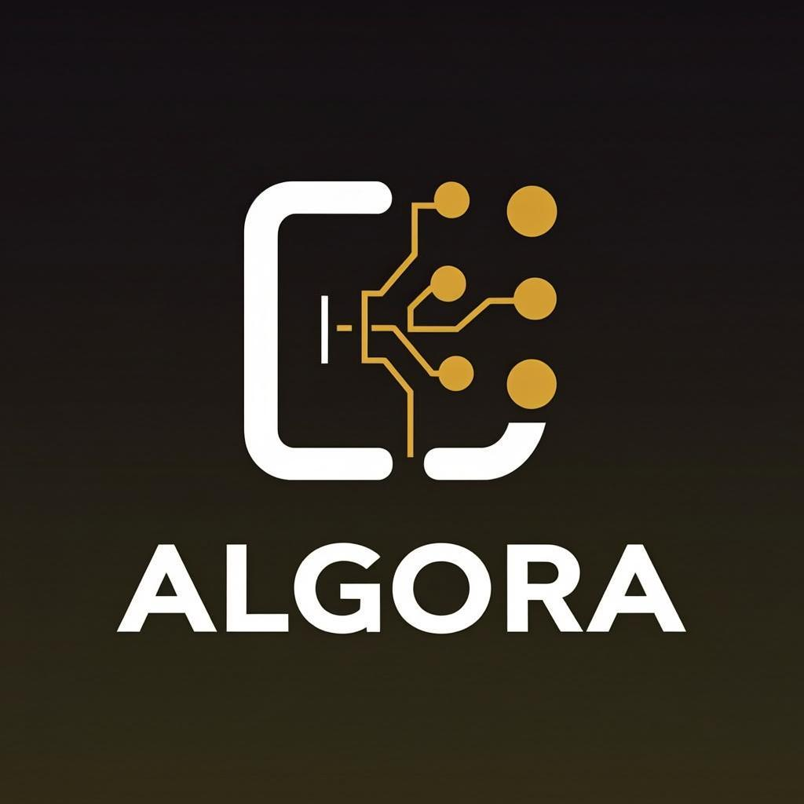

<p align="center">
  
</p>

<h1 align="center">Algora</h1>

<p align="center">
  <strong>Master Algorithms. Code the Future.</strong><br/>
  A bilingual (Arabic + English) algorithms & problem-solving education platform powered by AI.
</p>

<p align="center">
  
  
  
  
  
</p>

---

## Overview

**Algora** is the first bilingual algorithms & problem-solving platform designed for both Arabic and English speakers. It features AI-powered learning assistance, a real code editor, and a comprehensive collection of algorithmic challenges — making it the go-to platform for competitive programming learners in the Arab world and beyond.

## Features

- **Bilingual Content** — Full Arabic (RTL) + English (LTR) support
- **AI-Powered Assistant** — Get hints, explanations, and code reviews
- **Interactive Code Editor** — Write and test solutions in Python, JavaScript, C++, and Java
- **Problem Categories** — Arrays, Strings, Trees, Graphs, Dynamic Programming, and more
- **Difficulty Levels** — Easy, Medium, and Hard problems with acceptance rates
- **Dark-First Design** — Modern, eye-friendly interface optimized for long coding sessions
- **Responsive** — Fully responsive from mobile to desktop

## Tech Stack

| Technology | Purpose |
|------------|---------|
| [Next.js 16](https://nextjs.org/) | React Framework (App Router) |
| [TypeScript](https://www.typescriptlang.org/) | Type Safety |
| [Tailwind CSS 4](https://tailwindcss.com/) | Styling |
| [shadcn/ui](https://ui.shadcn.com/) | UI Components |
| [Prisma](https://www.prisma.io/) | Database ORM |
| [Supabase](https://supabase.com/) | Auth & Database |
| [next-intl](https://next-intl.dev/) | Internationalization |

## Getting Started

### Prerequisites

- Node.js 18+ or Bun
- A [Supabase](https://supabase.com/) project (for auth & database)

### Installation

```bash
# Clone the repository
git clone https://github.com/AliMahmoudDev/algora.git
cd algora

# Install dependencies
bun install
# or npm install

# Set up environment variables
cp .env.local.example .env.local
# Edit .env.local with your Supabase credentials

# Run the development server
bun dev
# or npm run dev
```

Open [http://localhost:3000](http://localhost:3000) in your browser.

### Environment Variables

| Variable | Description |
|----------|-------------|
| `NEXT_PUBLIC_SUPABASE_URL` | Your Supabase project URL |
| `NEXT_PUBLIC_SUPABASE_ANON_KEY` | Your Supabase anonymous key |

## Project Structure

```
src/
├── app/
│   ├── layout.tsx              # Root layout
│   ├── page.tsx                # Root redirect
│   ├── globals.css             # Global styles & theme
│   └── [locale]/
│       ├── layout.tsx          # Locale layout (RTL/LTR)
│       ├── page.tsx            # Landing page
│       ├── auth/
│       │   ├── signin/         # Sign In page
│       │   └── signup/         # Sign Up page
│       └── problems/
│           ├── page.tsx        # Problem list
│           └── [id]/page.tsx   # Problem view + editor
├── components/
│   ├── Navbar.tsx              # Navigation with language switcher
│   ├── HeroSection.tsx         # Landing hero
│   ├── FeaturesSection.tsx     # Features showcase
│   ├── StatsSection.tsx        # Platform stats
│   ├── ProblemsSection.tsx     # Sample problems
│   ├── HowItWorksSection.tsx   # How it works steps
│   ├── CTASection.tsx          # Call to action
│   ├── Footer.tsx              # Site footer
│   └── ui/                     # shadcn/ui primitives
├── data/
│   └── mock-problems.ts         # Bilingual mock problem data
├── i18n/
│   ├── routing.ts              # Locale routing config
│   └── request.ts              # Server i18n config
└── lib/
    ├── supabase/
    │   ├── client.ts           # Browser Supabase client
    │   └── server.ts           # Server Supabase client
    └── utils.ts                # Utilities
```

## Design System

| Token | Value | Usage |
|-------|-------|-------|
| Deep Void | `#0D0D12` | Primary background |
| Nebula | `#161622` | Secondary background |
| Card | `#1A1A2E` | Card backgrounds |
| Golden Amber | `#F59E0B` | Primary accent / CTAs |
| Emerald | `#10B981` | Success / Easy difficulty |
| Indigo | `#6366F1` | AI features |
| Crimson | `#EF4444` | Errors / Hard difficulty |

## Roadmap

- [x] Phase 1: Landing page with brand identity
- [x] Phase 2: Auth, Problem List, Problem View, i18n
- [ ] Phase 3: Monaco Editor integration
- [ ] Phase 4: Judge0 CE code execution
- [ ] Phase 5: AI Chatbot assistant
- [ ] Phase 6: User dashboard & progress tracking
- [ ] Phase 7: Real problem content & community features

## License

MIT License - see [LICENSE](LICENSE) for details.
